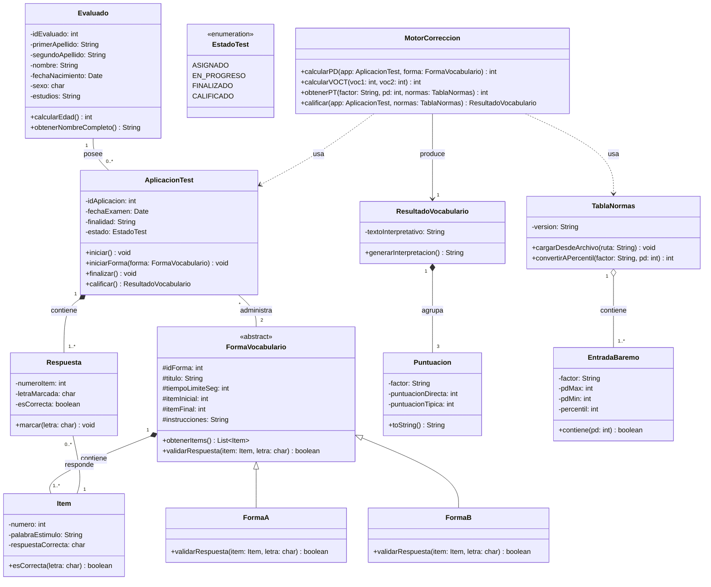

# Diagrama de Clases — Módulo de Vocabulario (BFA)

```mermaid
classDiagram
direction TB

class Evaluado {
  -idEvaluado: int
  -primerApellido: String
  -segundoApellido: String
  -nombre: String
  -fechaNacimiento: Date
  -sexo: char
  -estudios: String
  +calcularEdad() int
  +obtenerNombreCompleto() String
}

class AplicacionTest {
  -idAplicacion: int
  -fechaExamen: Date
  -finalidad: String
  -estado: EstadoTest
  +iniciar() void
  +iniciarForma(forma: FormaVocabulario) void
  +finalizar() void
  +calificar() ResultadoVocabulario
}

class EstadoTest {
  <<enumeration>>
  ASIGNADO
  EN_PROGRESO
  FINALIZADO
  CALIFICADO
}

class FormaVocabulario {
  <<abstract>>
  #idForma: int
  #titulo: String
  #tiempoLimiteSeg: int
  #itemInicial: int
  #itemFinal: int
  #instrucciones: String
  +obtenerItems() List~Item~
  +validarRespuesta(item: Item, letra: char) boolean
}

class FormaA {
  +validarRespuesta(item: Item, letra: char) boolean
}

class FormaB {
  +validarRespuesta(item: Item, letra: char) boolean
}

class Item {
  -numero: int
  -palabraEstimulo: String
  -respuestaCorrecta: char
  +esCorrecta(letra: char) boolean
}

class Respuesta {
  -numeroItem: int
  -letraMarcada: char
  -esCorrecta: boolean
  +marcar(letra: char) void
}

class MotorCorreccion {
  +calcularPD(app: AplicacionTest, forma: FormaVocabulario) int
  +calcularVOCT(voc1: int, voc2: int) int
  +obtenerPT(factor: String, pd: int, normas: TablaNormas) int
  +calificar(app: AplicacionTest, normas: TablaNormas) ResultadoVocabulario
}

class Puntuacion {
  -factor: String
  -puntuacionDirecta: int
  -puntuacionTipica: int
  +toString() String
}

class ResultadoVocabulario {
  -textoInterpretativo: String
  +generarInterpretacion() String
}

class TablaNormas {
  -version: String
  +cargarDesdeArchivo(ruta: String) void
  +convertirAPercentil(factor: String, pd: int) int
}

class EntradaBaremo {
  -factor: String
  -pdMax: int
  -pdMin: int
  -percentil: int
  +contiene(pd: int) boolean
}

Evaluado "1" -- "0..*" AplicacionTest : posee
AplicacionTest "*" -- "2" FormaVocabulario : administra
AplicacionTest "1" *-- "1..*" Respuesta : contiene
FormaVocabulario "1" *-- "1..*" Item : contiene
Respuesta "0..*" -- "1" Item : responde
FormaVocabulario <|-- FormaA
FormaVocabulario <|-- FormaB
MotorCorreccion ..> AplicacionTest : usa
MotorCorreccion ..> TablaNormas : usa
MotorCorreccion --> "1" ResultadoVocabulario : produce
ResultadoVocabulario "1" *-- "3" Puntuacion : agrupa
TablaNormas "1" o-- "1..*" EntradaBaremo : contiene
```